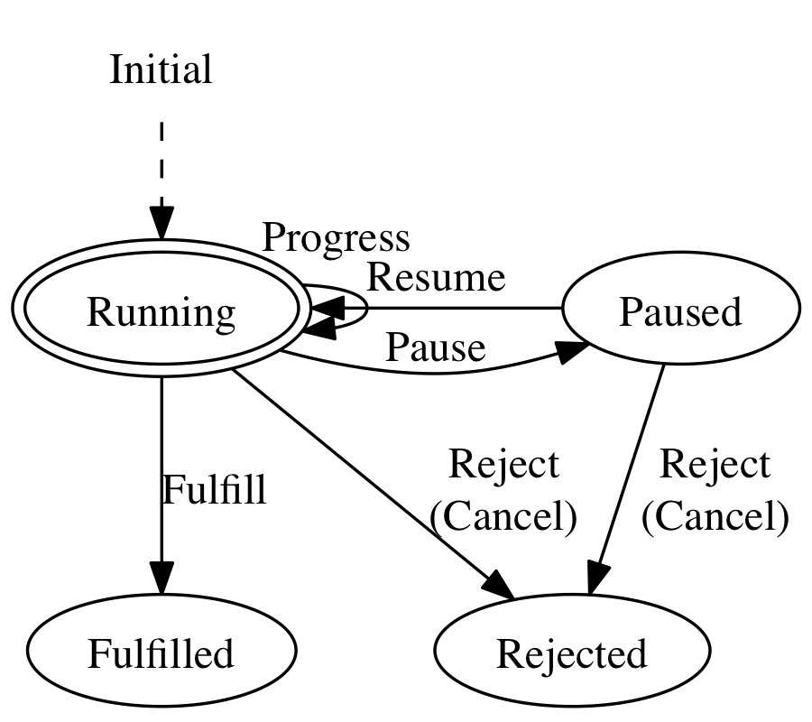

SwiftTask
=========

[Promise](http://www.html5rocks.com/en/tutorials/es6/promises/) + progress + pause + cancel, using [SwiftState](https://github.com/inamiy/SwiftState) (state machine).



### Ver 2.0.0 Changelog (2014/11/18)

- `task.progress()`'s `progressClosure` type changed from `Progress -> Void` to `(oldProgress: Progress?, newProgress: Progress) -> Void`
- `task.then(fulfilledClosure)` is renamed to `task.success()`
- `task.catch(catchClosure)` is renamed to `task.failure()`
- `task.then()` is no longer used for fulfilled-only handling (this will improve Swift type-inference)


## Example

### Basic

```swift
// define task
let task = Task<Float, String, NSError> { progress, fulfill, reject, configure in

    player.doSomethingWithProgress({ (progressValue: Float) in
        progress(progressValue) // optional
    }, completion: { (value: NSData?, error: NSError?) in
        if error == nil {
            fulfill("OK")
        }
        else {
            reject(error)
        }
    })

    // pause/resume/cancel configuration (optional)
    configure.pause = { [weak player] in
        if let p = player { p.pause() }
    }
    configure.resume = { [weak player] in
        if let p = player { p.resume() }
    }
    configure.cancel = { [weak player] in
        if let p = player { p.cancel() }
    }

}

// set onSuccess & onFailure
task.onSuccess { (value: String) -> Void in
    // do something with fulfilled value
}.onFailure { (error: NSError?, isCancelled: Bool) -> Void in
    // do something with rejected error
}

// you can call configured operations outside of Task-definition
task.pause()
task.resume()
task.cancel()
```

Notice that `player` has following methods, which will work nicely with `SwiftTask`:

- `doSomethingWithProgress(_:completion:)` (progress callback as optional)
- `pause()` (optional)
- `resume()` (optional)
- `cancel()` (optional)

One of the best example would be [Alamofire](https://github.com/Alamofire/Alamofire) (networking library)
 as seen below.

### Using [Alamofire](https://github.com/Alamofire/Alamofire)

```swift
typealias Progress = (bytesWritten: Int64, totalBytesWritten: Int64, totalBytesExpectedToWrite: Int64)
typealias AlamoFireTask = Task<Progress, String, NSError>

// define task
let task = AlamoFireTask { progress, fulfill, reject, configure in

    Alamofire.download(.GET, "http://httpbin.org/stream/100", destination: somewhere)
    .progress { bytesWritten, totalBytesWritten, totalBytesExpectedToWrite in

        progress((bytesWritten, totalBytesWritten, totalBytesExpectedToWrite) as Progress)

    }.response { request, response, data, error in

        if let error = error {
            reject(error)
            return
        }

        fulfill("OK")

    }

    return
}

// set onProgress & onComplete
task.onProgress { (oldProgress: Progress?, newProgress: Progress) in

    println("\(newProgress.bytesWritten)")
    println("\(newProgress.totalBytesWritten)")
    println("\(newProgress.totalBytesExpectedToWrite)")

}.onComplete { (value: String?, errorInfo: AlamoFireTask.ErrorInfo?) -> Void in
    // do something with fulfilled value or rejected errorInfo
}
```

For more examples, please see XCTest cases.


## API Reference

### Task.init(closure:)

Define your `task` inside `initClosure`.

```swift
let task = Task<Float, NSString?, NSError> { progress, fulfill, reject, configure in

    player.doSomethingWithCompletion { (value: NSString?, error: NSError?) in
        if error == nil {
            fulfill(value)
        }
        else {
            reject(error)
        }
    }
}
```

In order to pipeline future `task.value` or `task.errorInfo` (tuple of `(error: Error?, isCancelled: Bool)`) via `onComplete()`/`onSuccess()`/`onFailure()`, you have to call `fulfill(value)` and/or `reject(error)` inside `initClosure`.

Optionally, you can call `progress(progressValue)` multiple times before calling `fulfill`/`reject` to transfer `progressValue` outside of the `initClosure`, notifying it to `task` itself.

To add `pause`/`resume`/`cancel` functionality to your `task`, use `configure` to wrap up the original one.

```swift
// NOTE: use weak to let task NOT CAPTURE player via configure
configure.pause = { [weak player] in
    if let p = player { p.pause() }
}
configure.resume = { [weak player] in
    if let p = player { p.resume() }
}
configure.cancel = { [weak player] in
    if let p = player { p.cancel() }
}
```

### task.onProgress(_ progressClosure:) -> task

```swift
task.onProgress { (oldValue: Progress?, newValue: Progress) in
    println(newValue)
    return
}.onSuccess { ... }
```

`task.onProgress(progressClosure)` will add `progressClosure` to observe `progressValue` which is notified from inside previous `initClosure`. This method will return **same task**, so it is useful to chain with forthcoming `onComplete`/`onSuccess`/`onFailure`.

### task.onComplete(_ completeClosure:) -> newTask

`task.onComplete(completeClosure)` will return a new task where `completeClosure` will be invoked when `task` is either **fulfilled** or **rejected**.

This case is similar to JavaScript's `promise.then(onFulfilled, onRejected)`.

`completeClosure` can be two types of closure form:

1. `completeClosure: (Value?, ErrorInfo?) -> Value2` (flow: *task => newTask*)

  ```swift
  // let task will be fulfilled with value "Hello"

  task.onComplete { (value: String?, errorInfo: ErrorInfo?) -> String in
      // nil-check to find out whether task is fulfilled or rejected
      if errorInfo == nil {
          return "\(value!) World"
      }
      else {
          return "\(value!) Error"
      }
  }.onSuccess { (value: String) -> Void in
      println("\(value)")  // Hello World
      return"
  }
  ```

2. `completeClosure: (Value?, ErrorInfo?) -> Task` (flow: *task => task2 => newTask*)

  ```swift
  // let task will be fulfilled with value "Hello"

  task.onComplete { (value: String?, errorInfo: ErrorInfo?) -> Task<Float, String, NSError> in
      if errorInfo == nil {
          // let task2 will be fulfilled with value "\(value!) Swift"
          let task2 = ...
          return task2
      }
      else {
          return someOtherTask
      }
  }.onSuccess { (value: String) -> Void in
      println("\(value)")  // Hello Swift
      return"
  }
  ```

### task.onSuccess(_ successClosure:) -> newTask

Similar to `onComplete()` method, `task.onSuccess(successClosure)` will return a new task, but this time, `successClosure` will be invoked when task is **only fulfilled**.

This case is similar to JavaScript's `promise.then(onFulfilled)`.

```swift
// let task will be fulfilled with value "Hello"

task.onSuccess { (value: String) -> String in
  return "\(value) World"
}.onSuccess { (value: String) -> Void in
  println("\(value)")  // Hello World
  return"
}
```

### task.onFailure(_ failureClosure:) -> newTask

Just the opposite of `onSuccess()`, `task.onFailure(failureClosure)` will return a new task where `failureClosure` will be invoked when task is **only rejected/cancelled**.

This case is similar to JavaScript's `promise.then(undefined, onRejected)` or `promise.catch(onRejected)`.

```swift
// let task will be rejected with error "Oh My God"

task.onSuccess { (value: String) -> Void in
    println("\(value)") // never reaches here
    return
}.onFailure { (error: NSError?, isCancelled: Bool) -> Void in
    println("\(error!)")  // Oh My God
    return
}
```

### Task.all(_ tasks:) -> newTask

`Task.all(tasks)` is a new task that performs all `tasks` simultaneously and will be:

- fulfilled when **all tasks are fulfilled**
- rejected when **any of the task is rejected**

### Task.any(_ tasks:) -> newTask

`Task.any(tasks)` is an opposite of `Task.all(tasks)` which will be:

- fulfilled when **any of the task is fulfilled**
- rejected when **all tasks are rejected**

### Task.some(_ tasks:) -> newTask

`Task.some(tasks)` is a new task that performs all `tasks` without internal rejection, and is fulfilled with given `tasks`'s fulfilled values. Note that this new task **will be fulfilled with empty value-array, even though all `tasks` are rejected.**


## Related Articles

- [SwiftTask（Promise拡張）を使う - Qiita](http://qiita.com/inamiy/items/0756339aee35849384c3) (Japanese, ver 1.0.0)


## Licence

[MIT](https://github.com/inamiy/SwiftTask/blob/master/LICENSE)
